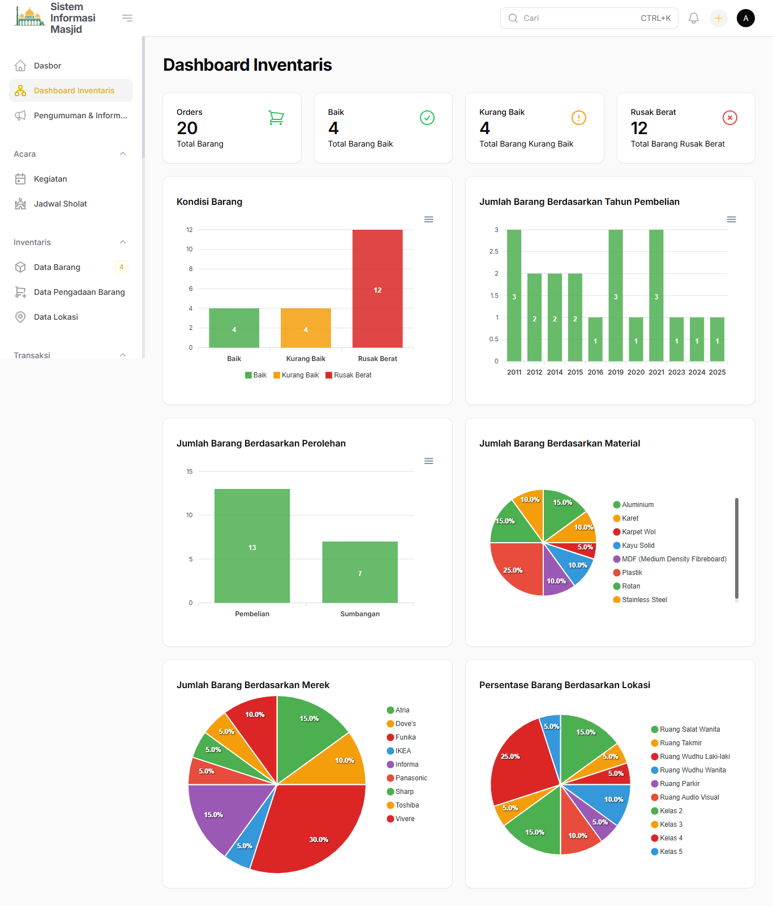

# SI Masjid

Sistem Informasi Masjid berbasis Laravel + Filament, mendukung manajemen keuangan, inventaris, jadwal sholat, pengumuman, dan fitur modern lainnya.



## Daftar Isi

-   [Persyaratan Sistem](#persyaratan-sistem)
-   [Fitur Utama](#fitur-utama)
-   [Cara Install](#cara-install)
-   [Catatan](#catatan)
-   [Lisensi](#lisensi)

## Persyaratan Sistem

Sebelum instalasi, pastikan sistem Anda memenuhi persyaratan berikut untuk menjalankan Laravel 11:

-   **PHP** >= 8.2 ([Download PHP](https://www.php.net/downloads))
-   **Composer** versi 2.3 atau lebih baru ([Download Composer](https://getcomposer.org/download/))
-   **Node.js** >= 18 & **NPM** ([Download Node.js & NPM](https://nodejs.org/en/download/))
-   **MySQL** >= 8 ([Download MySQL](https://dev.mysql.com/downloads/)) / **MariaDB** >= 10.3 ([Download MariaDB](https://mariadb.org/download/)) / [PostgreSQL](https://www.postgresql.org/download/) / [SQLite](https://www.sqlite.org/download.html)
-   **Ekstensi PHP**: OpenSSL, PDO, Mbstring, Tokenizer, XML, Ctype, JSON, BCMath, Fileinfo
-   (Opsional) **Redis** untuk queue & cache ([Download Redis](https://redis.io/download/))
-   (Opsional) **Pusher** untuk broadcast/real-time notification ([Pusher](https://pusher.com/))
-   (Opsional) **Telegram Bot Token** untuk notifikasi Telegram ([Buat Bot Telegram](https://core.telegram.org/bots#6-botfather))
-   (Opsional) **Google Client ID & Secret** untuk login Google OAuth ([Google Cloud Console](https://console.cloud.google.com/apis/credentials))

## Fitur Utama

-   **Manajemen Keuangan**

    -   Pencatatan transaksi pemasukan & pengeluaran
    -   Kategori transaksi & akun keuangan
    -   Rekening bank & integrasi notifikasi pembayaran

-   **Inventaris Masjid**

    -   Data barang, lokasi, dan pengadaan barang
    -   Statistik inventaris

-   **Jadwal Sholat & Kegiatan**

    -   Jadwal sholat otomatis berdasarkan lokasi
    -   Manajemen event/kegiatan masjid

-   **Manajemen Pengguna**

    -   Hak akses & peran (role)
    -   Registrasi & verifikasi email/telepon
    -   Notifikasi Telegram

-   **Pengumuman & Notifikasi**

    -   Template notifikasi dinamis
    -   Pengumuman ke semua pengguna
    -   Notifikasi via Telegram & database

-   **Pengaturan Website**
    -   SEO, sosial media, jam operasional, dan lainnya
    -   Dukungan multi bahasa

## Cara Install

1. **Clone Repository**

    ```sh
    git clone https://github.com/revanapriyandi/si_masjid.git
    cd si_masjid
    ```

2. **Install Dependency**

    ```sh
    composer install
    npm install
    ```

3. **Copy & Konfigurasi Environment**

    ```sh
    cp .env.example .env
    # Edit .env sesuai kebutuhan (database, mail, dsb)
    ```

4. **Generate Key**

    ```sh
    php artisan key:generate
    ```

5. **Migrasi & Seed Database**

    ```sh
    php artisan migrate --seed
    ```

6. **Build Frontend**

    ```sh
    npm run build
    ```

7. **Jalankan Server**

    ```sh
    php artisan serve
    ```

8. **Akses Aplikasi**
    - Buka [http://localhost:8000](http://localhost:8000)
    - Untuk Dashboard: [http://localhost:8000/panel](http://localhost:8000/panel)

## Catatan

-   Untuk notifikasi Telegram, isi konfigurasi di `.env` dan pengaturan admin.
-   Untuk fitur tertentu (misal: map), pastikan API key/konfigurasi sudah diisi.
-   Dokumentasi kode & struktur lebih lanjut dapat dilihat di masing-masing folder.

---

**Lisensi:** MIT
"# Sistem-Informasi-Masjid-berbasis-Laravel" 
